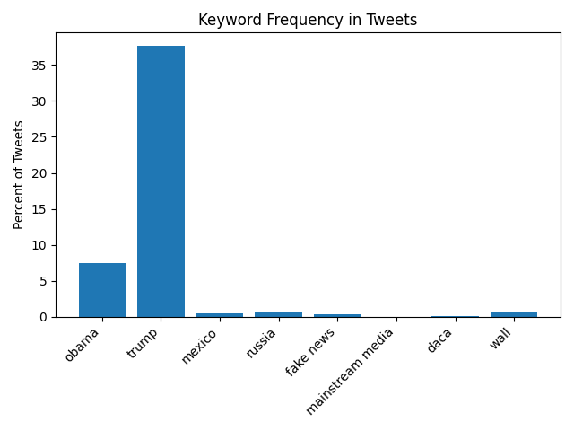

# Project Results

## Table 

| phrase            | percent of tweets |
| ----------------- | ----------------- |
|              daca | 000.17            |
|         fake news | 000.92            |
|  mainstream media | 000.06            |
|            mexico | 000.55            |
|             obama | 007.47            |
|            russia | 001.13            |
|             trump | 038.35            |
|              wall | 000.91            |

**Description:** This table shows my results. 

## Image

**Description:** This bar chart also shows my results. 